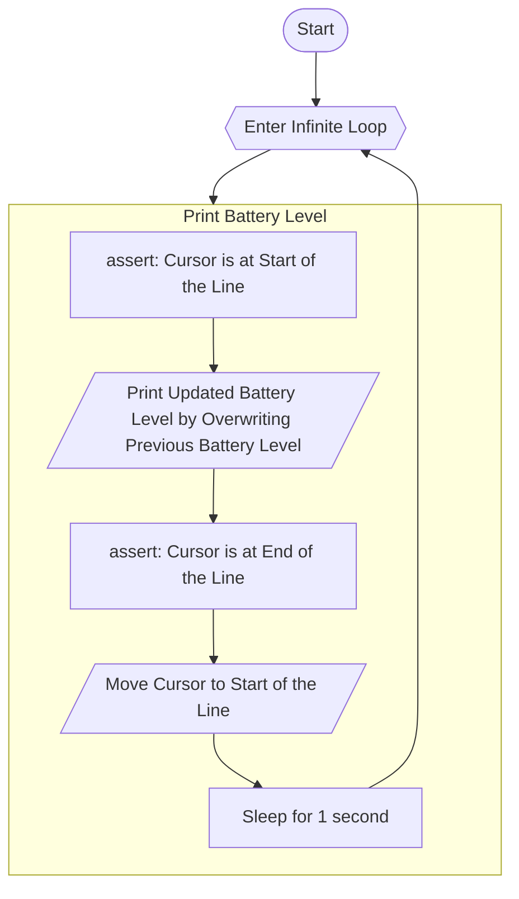
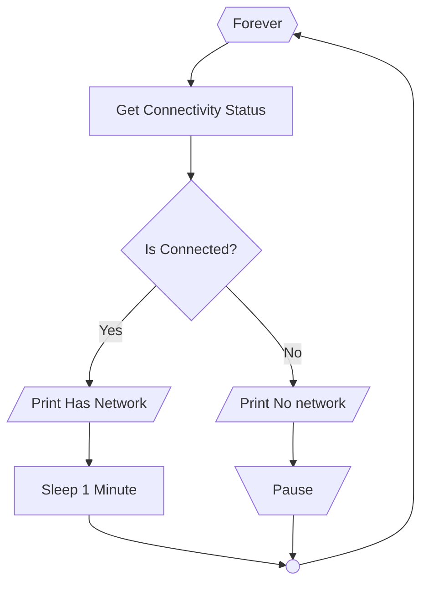
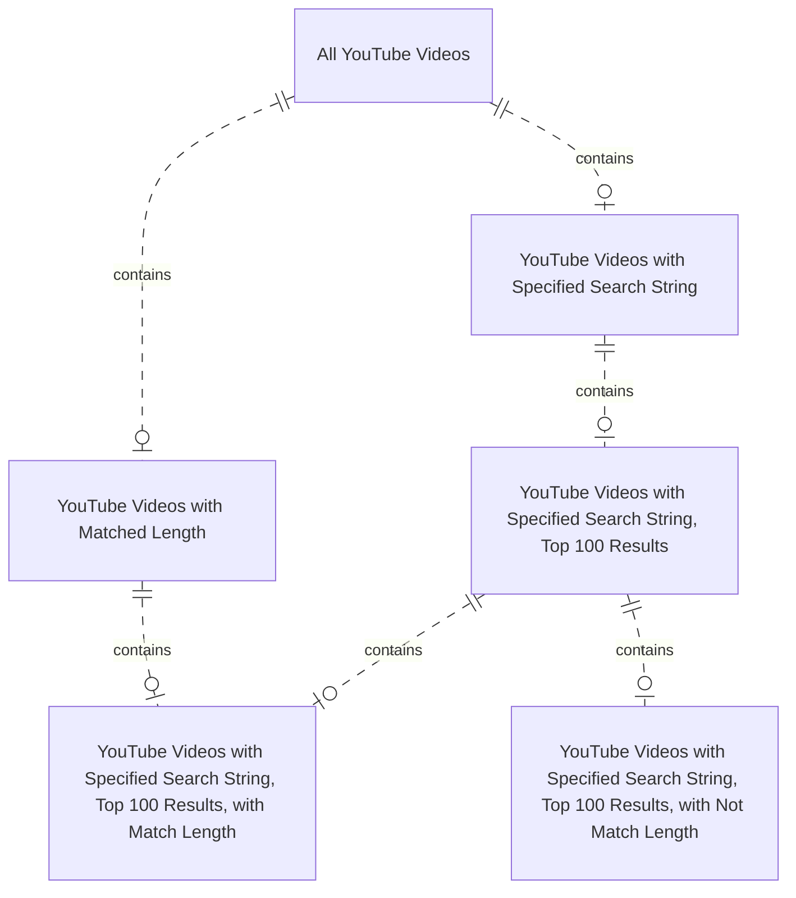

# mermaid-program-example
Examples of Mermaid diagram that represents programs

## Flowchart with subgraph  
Repo:
https://github.com/WingTillDie/battery-level-wsl/tree/main

## Flowchart with link label  
Repo:
https://github.com/WingTillDie/warn-no-network-windows

## Entity Relationship Diagram  
Repo:
https://github.com/WingTillDie/youtube-video-length

